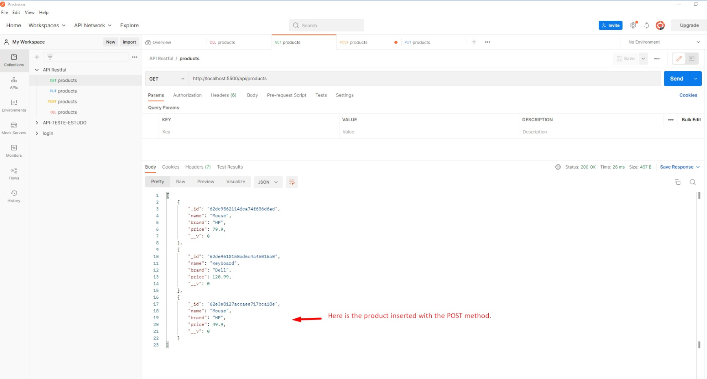
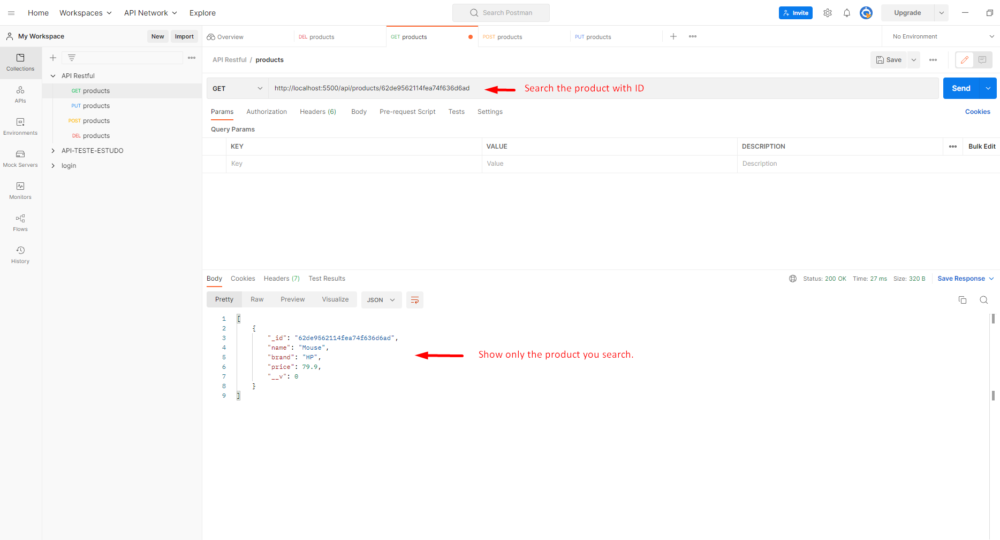
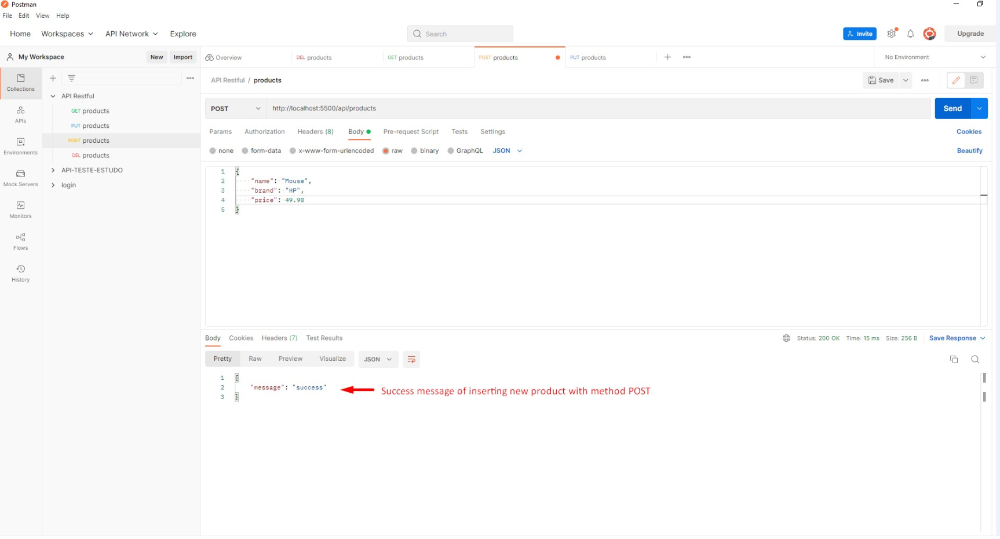
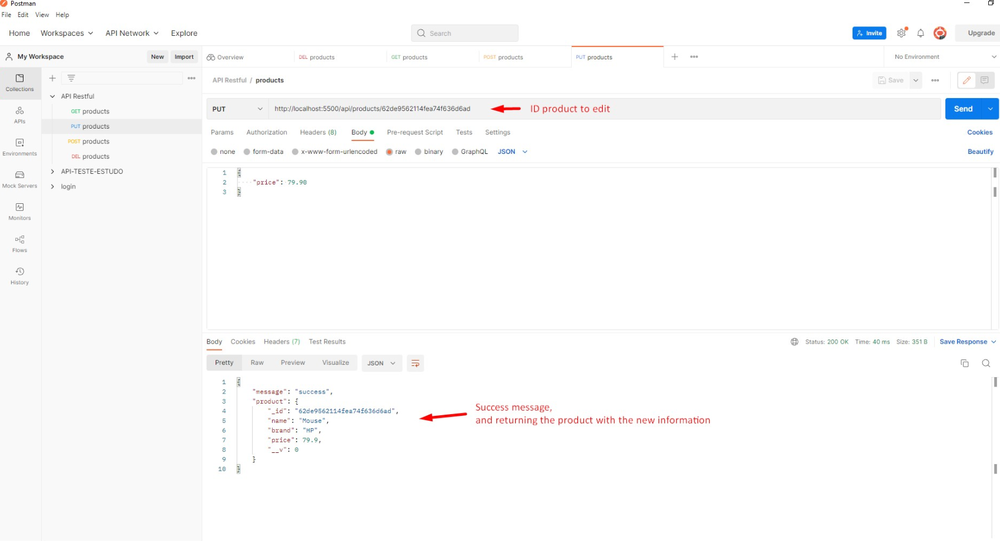
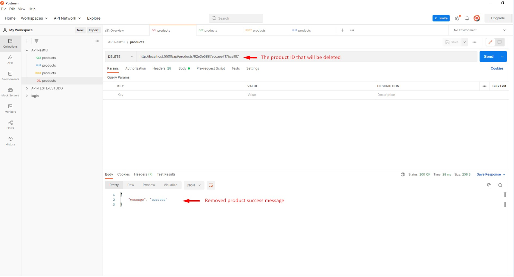

# API-RESTFUL MONGODB

## 💻 About the project

💻 API-RESTFUL -  The following tools were used to build the API-RESTFUL, they are NodeJS, Express and mongoDB. This structure makes the registration, listing, editing and removal of products as an example.

---

## ⚙️ Features

- [x] GET

### Product listing - GET: <http://localhost:5500/api/products/>

- In case of success, it returns all products already registered in the database, each product in JSON format, containing ID (generated by mongoDB) name, brand and price.

    <h1 align="center">
        
    </h1>

### Search product by Id - GET: <http://localhost:5500/api/produtos/{ID}>

- Uses the Id generated automatically when the product is added to the database. Returns the file in JSON format successfully if it exists. For this search it is necessary to insert the Id after api/products/.

    <h1 align="center">
        
    </h1>

- [x] POST

### Add Product - POST: <http://localhost:5500/api/products>

- Adds a product to the database, being necessary to enter the name, brand and price. The Id is generated automatically (as shown in the previous image in the GET method).

    <h1 align="center">
        
    </h1>

- [x] PUT

### Edit product - PUT: <http://localhost:5500/api/products/{ID}>

- Use the id of the registered product, in JSON format you put the information you want to update (the image shows the change in the price of the product). For this action it is necessary to insert the ID after api/products/.

    <h1 align="center">
        
    </h1>

- [x] DELETE

### Delete a product by Id - DELETE: <http://localhost:5500/api/products/{ID}>

- Removes the product using the Id that was generated automatically, using the DELETE method, after showing a success message.

    <h1 align="center">
        
    </h1>

---

## Getting started

This API-RESTFUL will run on **NodeJs** using **MongoDB** as database and **Postman** to see de response . I had tried to maintain the code structure easy as any beginner can also adopt the flow and start building an API-RESTFUL. Project is open for suggestions, Bug reports and pull requests.

## Software Requirements

- Node.js **16.13.1**
- MongoDB **3.6+** (Recommended **4+**)
- NPM **8.3.0**
- Postman **9.25.0**

## How to install packages with **NPM**

- npm init (start npm on project after install node and npm);
- npm install mongoose express (install dependencies for the project with just one command);
- npm install --save-dev nodemon (install nodemon for restart application only in dev dependencies) **This dependency is not mandatory but makes testing easier**.

### Running server locally

1. After install all dependencies open the file 'package.json'

- Change the scripts like this

```json
"scripts": {
    "dev": "nodemon src/server.js", // put this line
    "test": "echo \"Error: no test specified\" && exit 1"
  },
```

- Now you can run the project

```bash
npm run dev
```

- If is evertything ok, do you received message like this

```bash
> api-mongodb@1.0.0 dev
> nodemon src/server.js

[nodemon] 2.0.19
[nodemon] to restart at any time, enter `rs`
[nodemon] watching path(s): *.*
[nodemon] watching extensions: js,mjs,json
[nodemon] starting `node src/server.js`
Server is listening on port 5500
Connected to database

Press CTRL + C to stop the process.
```

## MongoDB

- Here you put your configuration to connect locally, i use the mongoDB compass and create my connection with name "api-restful", do you can put other name you like on your database e change on the string like "mongoose.connect('mongodb://localhost:27017/your-database-name?readPreference=primary&appname=MongoDB%20Compass&directConnection=true&ssl=false')".

```js
mongoose.connect('mongodb://localhost:27017/api-restful?readPreference=primary&appname=MongoDB%20Compass&directConnection=true&ssl=false')
```

## Project structure

```sh
.
├── package-lock.json
├── package.json
├── .gitignore
├── README.md
├── node_modules
└── src
    ├── controllers
    │   └── products.js
    ├── database
    │   └── db.js
    ├── models
    │   └── productsModel.js
    ├── public
    │   └── files
    │       ├── DELETE.png
    │       ├── GET.png
    │       ├── GET_ID.png
    │       ├── POST.png
    │       └── PUT.png
    ├── routes
    │   └── routes.js
    └── server.js
```

## Creating new models

- If you need to add more models to the project just create a new file in `/models/` and use them in the controllers.

## Creating new routes

- If you need to add more routes to the project just create a new file in `/routes/` and add it in `/routes/routes.js` it will be loaded dynamically.

## Creating new controllers

- If you need to add more controllers to the project just create a new file in `/controllers/` and use them in the routes.

## Bugs or improvements

- Every project needs improvements, Feel free to report any bugs or improvements. Pull requests are always welcome.

## 🛠 Technologies

### The following tool was used in building the project

- **[JavaScript](https://www.javascript.com/)**
- **[NodeJS](https://nodejs.org/en/)**
- **[NPM](https://www.npmjs.com/)**
- **[MongoDB](https://www.mongodb.com/products/compass)**

## Author

 
 <br />
 <sub><b>Henrique M. Kronhardt</b></sub></a>
 <br />

[](https://www.linkedin.com/in/henriquekronhardt/)

---

Made with ❤️ by Henrique M. Kronhardt 👋🏽 [Get in touch!](https://www.linkedin.com/in/henriquekronhardt/)
